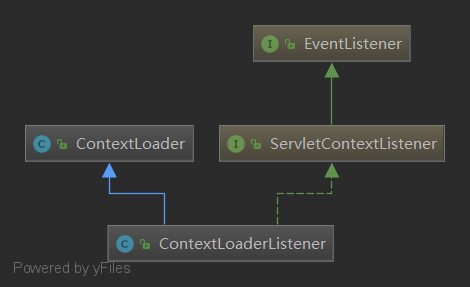
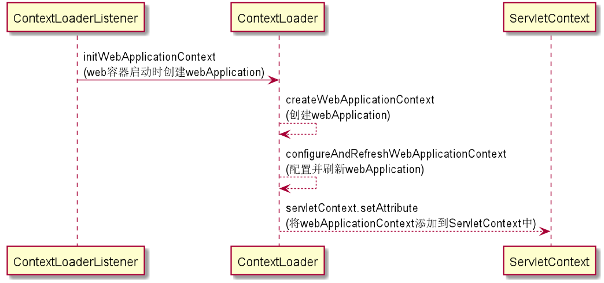
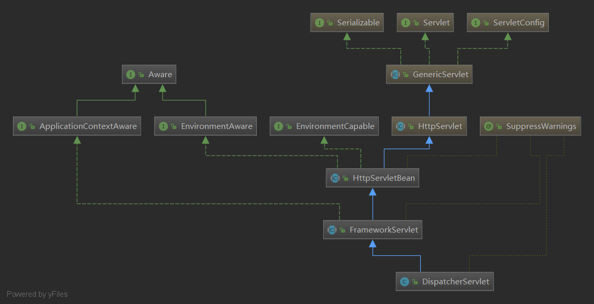

**spring源码阅读笔记**
======
1.Bean的创建
===
2.容器的创建
===
3.AOP的实现
===
4.jdbc,ORM集成方式
===
5.事务的实现机制
===
6.springMVC
===
6.1springMVC基本配置
---
+ web.xml配置
><web-app>
	<display-name>Archetype Created Web Application</display-name>
	<context-param>
		<param-name>contextConfigLocation</param-name>
		<param-value>classpath*:spring/spring.xml</param-value>
	</context-param>
	<listener>
		<listener-class>org.springframework.web.context.ContextLoaderListener</listener-class>
	</listener>
	<servlet>
		<servlet-name>dispatcherServlet</servlet-name>
		<servlet-class>org.springframework.web.servlet.DispatcherServlet</servlet-class>
		<init-param>
			<param-name>contextConfigLocation</param-name>
			<param-value>classpath*:spring/spring-mvc.xml</param-value>
		</init-param>
		<load-on-startup>1</load-on-startup>
	</servlet>
	<!-- Map all requests to the DispatcherServlet for handling -->
	<servlet-mapping>
		<servlet-name>dispatcherServlet</servlet-name>
		<url-pattern>*.html</url-pattern>
	</servlet-mapping>
</web-app>

6.2springMVC初始化
---
6.2.1 ContextLoaderListener
--
    ContextLoaderListener负责初始化、启动web容器，并将容器添加到ServletContext中
+ 类图

    
+ 源码
    ```
    public WebApplicationContext initWebApplicationContext(ServletContext servletContext) {
            if (servletContext.getAttribute(WebApplicationContext.ROOT_WEB_APPLICATION_CONTEXT_ATTRIBUTE) != null) {
                throw new IllegalStateException(
                        "Cannot initialize context because there is already a root application context present - " +
                        "check whether you have multiple ContextLoader* definitions in your web.xml!");
            }
    
            servletContext.log("Initializing Spring root WebApplicationContext");
            Log logger = LogFactory.getLog(ContextLoader.class);
            if (logger.isInfoEnabled()) {
                logger.info("Root WebApplicationContext: initialization started");
            }
            // 记录 root webApplication 初始化开始时间与结束时间
            long startTime = System.currentTimeMillis();
    
            try {
                // Store context in local instance variable, to guarantee that
                // it is available on ServletContext shutdown.
                if (this.context == null) {
                    // 创建webApplication容器
                    this.context = createWebApplicationContext(servletContext);
                }
                // 配置与刷新webApplication
                if (this.context instanceof ConfigurableWebApplicationContext) {
                    ConfigurableWebApplicationContext cwac = (ConfigurableWebApplicationContext) this.context;
                    if (!cwac.isActive()) {
                        // The context has not yet been refreshed -> provide services such as
                        // setting the parent context, setting the application context id, etc
                        if (cwac.getParent() == null) {
                            // The context instance was injected without an explicit parent ->
                            // determine parent for root web application context, if any.
                            ApplicationContext parent = loadParentContext(servletContext);
                            cwac.setParent(parent);
                        }
                        configureAndRefreshWebApplicationContext(cwac, servletContext);
                    }
                }
                //将web容器添加到ServletContext中
                servletContext.setAttribute(WebApplicationContext.ROOT_WEB_APPLICATION_CONTEXT_ATTRIBUTE, this.context);
    
                //将类加载器添加到当前线程中
                ClassLoader ccl = Thread.currentThread().getContextClassLoader();
                if (ccl == ContextLoader.class.getClassLoader()) {
                    currentContext = this.context;
                }
                else if (ccl != null) {
                    currentContextPerThread.put(ccl, this.context);
                }
    
                if (logger.isInfoEnabled()) {
                    long elapsedTime = System.currentTimeMillis() - startTime;
                    logger.info("Root WebApplicationContext initialized in " + elapsedTime + " ms");
                }
    
                return this.context;
            }
            catch (RuntimeException | Error ex) {
                logger.error("Context initialization failed", ex);
                servletContext.setAttribute(WebApplicationContext.ROOT_WEB_APPLICATION_CONTEXT_ATTRIBUTE, ex);
                throw ex;
            }
        }
    ```
+ 初始化WebApplicationContext

    

6.2.2 DispatcherServlet
--
DispatcherServlet是一个Servlet,作为一个前端控制器，来调度请求逻辑
+ 类图
    
+ 初始化
6.3请求调用过程
---